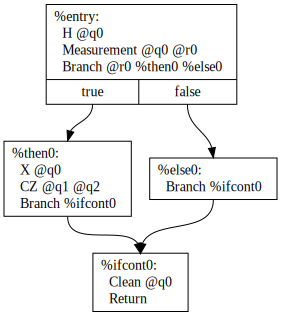
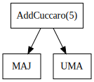
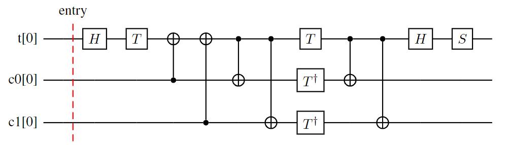

\page main Main

`quration-core/main/` では、 qret のバイナリを実装する。

## How to use

バイナリの使用方法は `--help` オプションで確認できる。
`./qret compile ...` や `./qret simulate ...` のように、バイナリの後にコマンドを続け、その後にコマンドに沿ったオプションを入力する。
現在、次の 8 つのコマンドを実装している。

1. `asm` : ターゲットの JSON（パイプライン状態）からアセンブリを出力する
2. `compile` : 入力ファイルをターゲットの量子コンピュータにコンパイルする
3. `diagram` : 中間表現を可視化する
4. `opt` : 中間表現を最適化する
5. `parse` : 様々なフォーマットのファイルをパースし、中間表現を作成する
6. `print` : 中間表現の命令列を理解しやすい形でプリントする
7. `profile` : ターゲットの JSON（パイプライン状態）から統計情報を出力する
8. `simulate` : 中間表現をシミュレータで実行する

```sh
$ qret --help
-- Quration: Quantum Resource Estimation Toolchain for FTQC (version 0.7.2) --

Usage:
  qret [command] [options]

Example usage:
  qret help [ -h, --help ]
  qret version [ -v, --version ]
  qret compile -h
  qret simulate -h
Available commands:
  help version asm compile diagram opt parse print profile simulate
```

## コマンド : asm

`asm` コマンドは、ターゲットのパイプライン状態ファイルからアセンブリを出力する。
`asm` コマンドの使用方法は `--help` オプションで確認できる。

```sh
$ qret asm --help
qret 'asm' options:
  -h [ --help ]                         Show this help and exit.
  --quiet                               Suppress non-error output.
  --verbose                             Enable verbose logging (more detail
                                        than default).
  --debug                               Enable debug logging (most detailed;
                                        implies --verbose).
  --color                               Enable colored output.
  -s [ --source ] arg (=SC_LS_FIXED_V0) Source representation. Currently only
                                        'SC_LS_FIXED_V0' is supported.
  -t [ --target ] arg (=SC_LS_FIXED_V0) Target name used to select asm printer.
  --print-metadata BOOL (=1)            Print instruction metadata. If false,
                                        SC_LS_FIXED_V0 output will omit
                                        instruction metadata.
  -i [ --input ] arg                    Input file
  -o [ --output ] arg (=out.asm)        Output file
```

## コマンド : compile

`compile` コマンドは、 入力ファイルをターゲットの量子コンピュータの命令列にコンパイルする。
`compile` コマンドの使用方法は `--help` オプションで確認できる。

```sh
$ qret compile --help

qret 'compile' options:
  -h [ --help ]                         Show this help and exit.
  --help-hidden                         Show help including hidden options.
  --quiet                               Suppress non-error output.
  --verbose                             Enable verbose logging (more detail than default).
  --debug                               Enable debug logging (most detailed; implies --verbose).
  --color                               Enable colored output.
  --pipeline FILE                       Path to a pipeline specification file.
  -i [ --input ] FILE                   Path to the input file.
  -f [ --function ] NAME                 [source=IR] Name of the function to compile.
  -o [ --output ] FILE (=a.json)        Path to the output SC_LS_FIXED_V0 file.
  -s [ --source ] KIND (=IR)            Source representation: 'IR', 'OpenQASM2', or 'SC_LS_FIXED_V0'.
  -t [ --target ] KIND (=SC_LS_FIXED_V0)
                                        Target machine name.
  --sc_ls_fixed_v0_topology FILE                  Path to the SC_LS_FIXED_V0 topology file.
  --sc_ls_fixed_v0_machine_type TYPE (=auto)      SC_LS_FIXED_V0 machine type: 'Dim2', 'Dim3', 'DistributedDim2', or
                                        'DistributedDim3' (currently unsupported). When 'auto' (default), the type is inferred from --sc_ls_fixed_v0_topology as the 
                                        minimum required.
  --sc_ls_fixed_v0_enable_pbc_mode      Enable Pauli Based Computing lowering mode.
  --sc_ls_fixed_v0_use_magic_state_cultivation    Simulate magic-state factories using the cultivation method (requires 
                                        --sc_ls_fixed_v0_magic_factory_seed_offset, --sc_ls_fixed_v0_prob_magic_state_creation).
  --sc_ls_fixed_v0_magic_factory_seed_offset arg (=0)
                                        Base seed offset for RNG initialization of each magic-state factory. Required 
                                        only if --sc_ls_fixed_v0_use_magic_state_cultivation=true.
  --sc_ls_fixed_v0_magic_generation_period arg (=15)
                                        Beats required to produce one magic state.
  --sc_ls_fixed_v0_prob_magic_state_creation arg (=1)
                                        Per-attempt success probability for magic-state creation. Required only if 
                                        --sc_ls_fixed_v0_use_magic_state_cultivation=true.
  --sc_ls_fixed_v0_maximum_magic_state_stock arg (=10000)
                                        Maximum number of magic states storable in a factory.
  --sc_ls_fixed_v0_entanglement_generation_period arg (=100)
                                        Beats required to generate one entangled pair.
  --sc_ls_fixed_v0_maximum_entangled_state_stock arg (=10)
                                        Maximum number of entangled pairs storable in a factory.
  --sc_ls_fixed_v0_reaction_time arg (=1)         Feed-forward latency in beats from measurement to error-corrected value.
  --sc_ls_fixed_v0_physical_error_rate arg (=0)
                                        Physical error rate p for logical error estimation.
  --sc_ls_fixed_v0_drop_rate arg (=0)   Drop rate Lambda for logical error estimation.
  --sc_ls_fixed_v0_code_cycle_time_sec arg (=0)
                                        Code cycle time in seconds (t_cycle) for execution time estimation.
  --sc_ls_fixed_v0_allowed_failure_prob arg (=0)
                                        Allowed failure probability (eps) for logical error estimation.
  --sc_ls_fixed_v0_pass PASS            SC_LS_FIXED_V0 compile pass to run. Accepts a single pass or a comma-separated list.
  --sc_ls_fixed_v0_dump_compile_info_to_json arg  Dump compile information to json
  --sc_ls_fixed_v0_dump_compile_info_to_markdown arg
                                        Dump compile information to markdown
```

非自明なオプションの説明

* `--function` : コンパイルする関数の名前
  * `--source IR` の場合は必須
  * `--source OpenQASM2` の場合はエントリ回路名として任意指定
* `--source` : 入力ファイルの種類を指定する
  * 入力ファイルがどのような命令列かを指定する
  * `IR` の場合: 入力ファイルが JSON ファイルで定義された中間表現であることを指定する
  * `OpenQASM2` の場合: 入力ファイルが OpenQASM2 であることを指定する
  * `SC_LS_FIXED_V0` の場合: 入力ファイルが SC_LS_FIXED_V0 のパイプライン状態ファイルであることを指定する
* `--target` : コンパイル先のマシンを指定する
  * 現在は `SC_LS_FIXED_V0` を指定する
* `sc_ls_fixed_v0_topology` : トポロジーを指定するファイルへのパス
* `sc_ls_fixed_v0_machine_type` : SC_LS_FIXED_V0 のどの言語でコンパイルするかを指定する
  * `Dim2`, `Dim3`, `DistributedDim2`, `DistributedDim3`（現在未対応）
  * 指定しない場合は、トポロジーファイルから `Dim2`, `Dim3`, `DistributedDim2`, or `DistributedDim3` のいずれかが自動で選択される。
* `sc_ls_fixed_v0_enable_pbc_mode` : Pauli Based Computing (PBC) lowering を有効化する
* `sc_ls_fixed_v0_use_magic_state_cultivation` : 魔法状態工場を cultivation method で実装する場合をシミュレートする
* `sc_ls_fixed_v0_magic_factory_seed_offset` : 魔法状態工場のシードのオフセット (実際のシードはオフセットに魔法状態工場のIDを加算した値)
  * `--sc_ls_fixed_v0_use_magic_state_cultivation=true` の時のみ有効なオプション
* `sc_ls_fixed_v0_magic_generation_period` : 魔法状態工場が一つの魔法状態を作成するのに要するビート数
* `sc_ls_fixed_v0_prob_magic_state_creation` : 魔法状態工場で一つの魔法状態の作成に成功する確率
  * `--sc_ls_fixed_v0_use_magic_state_cultivation=true` の時のみ有効なオプション
* `sc_ls_fixed_v0_maximum_magic_state_stock` : 魔法状態工場が貯蓄できる魔法状態の数
* `sc_ls_fixed_v0_entanglement_generation_period` : 論理エンタングルメント工場が一つのエンタングルメントペアを作成するのに要するビート数
* `sc_ls_fixed_v0_maximum_entangled_state_stock` : 論理エンタングルメント工場が貯蓄できるエンタングルメントペアの数
* `sc_ls_fixed_v0_reaction_time` : 測定したレジスタの誤り訂正までに要するビート数
* `sc_ls_fixed_v0_physical_error_rate` : QEC リソース推定における物理エラー率 `p`
* `sc_ls_fixed_v0_drop_rate` : QEC リソース推定におけるドロップ率 `Lambda`
* `sc_ls_fixed_v0_code_cycle_time_sec` : QEC リソース推定におけるコードサイクル時間 `t_cycle`（秒）
* `sc_ls_fixed_v0_allowed_failure_prob` : QEC リソース推定における許容失敗確率 `eps`
* `sc_ls_fixed_v0_pass` : SC_LS_FIXED_V0 の機械語に実行する最適化パスを指定する
  * 複数の最適化パスを指定する場合は `,` で区切る
  * 例: 次のように指定すると、命令列のコンパイル時情報を取得できる
    * `"sc_ls_fixed_v0::calc_info_without_topology,sc_ls_fixed_v0::calc_info_with_topology"`
* `sc_ls_fixed_v0_dump_compile_info_to_json` : コンパイル時の統計情報を json 形式でダンプする
* `sc_ls_fixed_v0_dump_compile_info_to_markdown` : コンパイル時の統計情報を markdown 形式でダンプする

### 最適化パスのパラメータの指定

qret では最適化パスのパラメータをグローバル変数で設定している。
いくつかのグローバル変数はコマンドラインから値を指定できる。
設定できるグローバル変数の一覧は `--help-hidden` から確認できる。

```sh
$ qret compile --help-hidden
(中略)

Hidden options:
  --help-really-hidden                  Display available options including really hidden ones
  --sc_ls_fixed_v0-find-place-algorithm arg (=0)  Find place algorithm of mapping (0: EnoughSpaceSoft, 1: EnoughSpaceHard)
  --sc_ls_fixed_v0-inst-queue-peek-size arg (=1000)
                                        Peek size of instruction queue
  --sc_ls_fixed_v0-inst-queue-weight-algorithm arg (=2)
                                        Weight algorithm of instruction queue (0: index, 1: type, 2: InvDepth)
  --sc_ls_fixed_v0-mapping-algorithm arg (=1)     Mapping algorithm (0: Map based on topology file, 1: Auto)
  --sc_ls_fixed_v0-partition-algorithm arg (=0)   Partition algorithm of mapping (0: Greedy, 1: Random, 2: METIS)
  --sc_ls_fixed_v0-print-inst-metadata arg (=0)   Print metadata of instructions (beat and z coordinate).
  --sc_ls_fixed_v0-state-buffer-width arg (=20)   Buffer width of quantum states
  --ir-static-condition-pruning-seed arg (=0)
                                        Seed of StaticConditionPruningPass
```

* `sc_ls_fixed_v0-find-place-algorithm` : Mapping の際に qubit の置く位置を探索するアルゴリズム
* `sc_ls_fixed_v0-inst-queue-peek-size` : Routing の際に命令キューが読み込む命令列の長さ
  * 読み込む命令列が長いほどより先の命令を読み込み最適な Routing が可能となる
  * 一方、 Routing に要する時間は長くなる
* `sc_ls_fixed_v0-inst-queue-weight-algorithm` : Routing の際の命令キューにおける重みづけアルゴリズム
  * 複数の命令が実行可能な場合、それぞれの命令に重みに従って Routing する順序を決定する
* `sc_ls_fixed_v0-mapping-algorithm` : Mapping のアルゴリズム
  * `0` の場合はトポロジーファイルで指定されたように Mapping する
  * `1` の場合はトポロジーファイルの qubit の座標情報を無視して Mapping する
    * 魔法状態工場やエンタングルメント工場は無視しない
* `sc_ls_fixed_v0-partition-algorithm` : Multinode SC_LS_FIXED_V0 にコンパイルする際に、 qubit をどのチップに割り当てるか選択するアルゴリズム
  * `METIS` は未実装
* `sc_ls_fixed_v0-print-inst-metadata`
  * アセンブリに命令列のみならず、メタデータも出力する
  * メタデータ
    * Routing の際にいつ実行されたか
    * Routing の際にどの z 座標で実行されたか
* `sc_ls_fixed_v0-state-buffer-width` : Routing の際に状態バッファが保持するビート数
  * 状態バッファはビート t からビート s までの量子コンピュータのすべての状態を保持する
  * 幅とは `t - s + 1` のことである
  * 幅が大きいとより多くの状態を保持するため、より広範囲にわたる探索が可能となる
  * 一方、 Routing に要する時間は長くなる
* `ir-static-condition-pruning-seed` : 中間表現のランダム命令の値を計算するオフセット
  * `StaticConditionPruningPass` で使用する値
  * 中間表現におけるランダム命令の値をあらかじめ決定し、分岐命令の分岐先を可能な限りあらかじめ決定する

### 例1: 中間表現を SC_LS_FIXED_V0 にコンパイルする

中間表現 `quration-core/examples/data/circuit/add_cuccaro_5.json` を SC_LS_FIXED_V0 にコンパイルする場合、次のようにコマンドを入力する。

```sh
qret compile --verbose --input quration-core/examples/data/circuit/add_cuccaro_5.json --function "AddCuccaro(5)" --output quration-core/examples/data/add_cuccaro_5.json --sc_ls_fixed_v0_topology quration-core/examples/data/topology/tutorial.yaml
```

### 例2: SC_LS_FIXED_V0 のパイプライン状態ファイルを出力し、外部ライブラリで最適化する

SC_LS_FIXED_V0 のパイプライン状態ファイルを出力する。

```sh
qret compile --verbose --input quration-core/examples/data/circuit/add_cuccaro_5.json --function "AddCuccaro(5)" --output pipeline_state.json --sc_ls_fixed_v0_topology quration-core/examples/data/topology/tutorial.yaml --sc_ls_fixed_v0_pass "sc_ls_fixed_v0::mapping,sc_ls_fixed_v0::routing"
```

`pipeline_state.json` を何らかの方法で最適化したとする。
その後また `qret` で次のコマンドを実行すると、最適化した SC_LS_FIXED_V0 のパイプライン状態ファイルを再出力できる。

```sh
qret compile --verbose --input pipeline_state.json --output out2.json --source SC_LS_FIXED_V0 --target SC_LS_FIXED_V0 --sc_ls_fixed_v0_topology quration-core/examples/data/topology/tutorial.yaml --sc_ls_fixed_v0_pass "sc_ls_fixed_v0::calc_info_without_topology,sc_ls_fixed_v0::calc_info_with_topology,sc_ls_fixed_v0::dump_compile_info"
```

### 例3: パイプラインファイルを与えてコンパイルする

コンパイルの入出力やパスの順番等をパイプラインファイルに定義し、それを渡すことでコンパイルすることができる。
パイプラインファイルでパスの順番等を指定する場合、外部ライブラリのパスも含めることできる。
`quration-core/examples/data/pipeline/qret_compile.yaml` では `My3DRouting` というパスを追加している。

```sh
qret compile --verbose --pipeline quration-core/examples/data/pipeline/qret_compile.yaml
```

## コマンド : diagram

`diagram` コマンドは、 JSON ファイルで定義された中間表現を様々なフォーマットで可視化する。
`diagram` コマンドの使用方法は `--help` オプションで確認できる。

```sh
$ qret diagram --help
qret 'diagram' options:
  -h [ --help ]         Show this help and exit.
  --quiet               Suppress non-error output.
  --verbose             Enable verbose logging (more detail than default).
  --debug               Enable debug logging (most detailed; implies 
                        --verbose).
  --color               Enable colored output.
  -i [ --input ] arg    Input file
  --function arg         The name of function to draw
  -o [ --output ] arg   Output file (default is 'out.dot' or 'out.tex')
  -g [ --graph-format ] arg   Format of diagram to generate ('CFG', 'CallGraph', 
                        'LaTeX', or 'ComputeGraph')
  --display_num_calls   [CallGraph] Display how many times function is called
```

### 例1: CFG

`--graph-format` で `CFG` を選択すると、回路の Control Flow Graph (CFG) を dot 言語で可視化できる。
次のコマンドを実行すると `out.dot` を出力する。

```sh
qret diagram --verbose -i quration-core/examples/data/circuit/add_craig_5.json --function "UncomputeTemporalAnd" --graph-format CFG
```



### 例2: CallGraph

`--graph-format` で `CallGraph` を選択すると、回路の Call Graph を dot 言語で可視化できる。
次のコマンドを実行すると `out.dot` を出力する。

```sh
qret diagram --verbose -i quration-core/examples/data/circuit/add_cuccaro_5.json --function "AddCuccaro(5)" --graph-format CallGraph
```



### 例3: 回路図

`--graph-format` で `LaTeX` を選択すると、回路図を LaTeX の quantikz パッケージを使用して可視化できる。
次のコマンドを実行すると `out.tex` を出力する。

```sh
qret diagram -i quration-core/examples/data/circuit/add_craig_5.json --function "TemporalAnd" --graph-format LaTeX
```



## コマンド : opt

`opt` コマンドは、中間表現を最適化する。
`opt` コマンドの使用方法は `--help` オプションで確認できる。

```sh
$ qret opt --help
qret 'opt' options:
  -h [ --help ]                         Show this help and exit.
  --quiet                               Suppress non-error output.
  --verbose                             Enable verbose logging (more detail 
                                        than default).
  --debug                               Enable debug logging (most detailed; 
                                        implies --verbose).
  --color                               Enable colored output.
  --pipeline arg                        Pipeline file
  -i [ --input ] arg                    Input file
  -f [ --function ] arg                  The name of function to compile
  -o [ --output ] arg                   Output file
  --ir-static-condition-pruning-seed arg (=0)
                                        Seed of ir::static_condition_pruning 
                                        pass.
  --pass arg                            Optimization pass
```

## コマンド : parse

`parse` コマンドは、様々なフォーマットのファイルから中間表現を作成する。
`parse` コマンドの使用方法は `--help` オプションで確認できる。

```sh
$ qret parse --help
qret 'parse' options:
  -h [ --help ]                    Show this help and exit.
  --quiet                          Suppress non-error output.
  --verbose                        Enable verbose logging (more detail than 
                                   default).
  --debug                          Enable debug logging (most detailed; implies
                                   --verbose).
  --color                          Enable colored output.
  -i [ --input ] arg               Input file
  -o [ --output ] arg (=ir.json)   Output file
  -f [ --format ] arg (=OpenQASM2) Format of input file ('OpenQASM2' or 
                                   'OpenQASM3')
```

## コマンド : print

`print` コマンドは、 JSON ファイルで定義された中間表現の命令列を人が理解しやすい形でプリントする。
`print` コマンドの使用方法は `--help` オプションで確認できる。

```sh
$ qret print --help
qret 'print' options:
  -h [ --help ]           Show this help and exit.
  --quiet                 Suppress non-error output.
  --verbose               Enable verbose logging (more detail than default).
  --debug                 Enable debug logging (most detailed; implies 
                          --verbose).
  --color                 Enable colored output.
  -i [ --input ] arg      Path to input IR file.
  -s [ --summary ]        Print summary only. If --function is omitted, prints module summary.
  -f [ --function ] arg    Function name; with --summary, prints only that function's summary.
  -d [ --depth ] arg (=1) Descend only 'depth' call deep
  --print_debug_info      Print debug info
```

## コマンド : profile

`profile` コマンドは、ターゲットのパイプライン状態ファイルから統計情報を計算して出力する。
`profile` コマンドの使用方法は `--help` オプションで確認できる。

```sh
$ qret profile --help
qret 'profile' options:
  -h [ --help ]                         Show this help and exit.
  --quiet                               Suppress non-error output.
  --verbose                             Enable verbose logging (more detail
                                        than default).
  --debug                               Enable debug logging (most detailed;
                                        implies --verbose).
  --color                               Enable colored output.
  -s [ --source ] arg (=SC_LS_FIXED_V0) Source representation. Currently only
                                        'SC_LS_FIXED_V0' is supported.
  -f [ --format ] arg (=json)           Output format: 'json' or 'markdown'.
  -i [ --input ] arg                    Input file
  -o [ --output ] arg (=compile_info.json)
                                        Output file
```

## コマンド : simulate

`simulate` コマンドは、JSON ファイルで定義された中間表現の function をシミュレートする。

```sh
$ qret simulate --help
qret 'simulate' options
Simulate a function in an IR file.

Examples:
  qret simulate --input <ir-file> --function <name>
  qret simulate --input <ir-file> --function <name> --state Toffoli --max_superpositions 16 --init_state 0101 --num_samples 8
  qret simulate --input <ir-file> --function <name> --state FullQuantum --print_raw
:
  -h [ --help ]                    Show this help and exit.
  --quiet                          Suppress non-error output.
  --verbose                        Enable verbose logging (more detail than default).
  --debug                          Enable debug logging (most detailed; 
                                    implies --verbose).
  --color                          Enable colored output.
  -i [ --input ] arg                Path of input IR file.
  -f [ --function ] arg             Function name to simulate.
  -s [ --state ] arg (=FullQuantum) Simulation model. Allowed values:
                                    FullQuantum, Toffoli. Aliases:
                                    full|fullquantum for FullQuantum, tof for
                                    Toffoli.
  --init_state arg                  Initial state as binary string for all
                                    circuit qubits. The first char is q0,
                                    second is q1, ... (LSB-first). E.g.
                                    --init_state 0101 means q0=0, q1=1, q2=0,
                                    q3=1. Whitespace and '_' are ignored; 0b
                                    prefix is accepted. Empty means all zeros.
  --seed arg (=1)                   Seed for the first run. For repeated runs,
                                    this value is incremented by 1 each time.
  -n [ --num_samples ] arg (=0)     Number of simulation runs. Seeds are
                                    changed for each run using `seed +
                                    run_index`. If omitted and --print_raw is
                                    not set for FullQuantum, defaults to 10.
  --sample_summary                  Output only sampling summary (FullQuantum
                                    only).
  --print_raw                       For FullQuantum: print expanded state
                                    vector. For Toffoli, raw state is shown.
  --use_qulacs                      [FullQuantum] Use Qulacs backend if
                                    available.
  --max_superpositions arg (=1)     [Toffoli] Maximum number of superpositions
                                    allowed during simulation.
```

### 例1: Cuccaro 加算回路のシミュレーション

幅 5 の Cuccaro の加算回路 `quration-core/examples/data/circuit/add_cuccaro_5.json` で `6+=19` の計算をシミュレートする場合を例とする。
実行する関数の名前は `AddCuccaro(5)` であるため、 `--function "AddCuccaro(5)"` をオプションに追加する。
`AddCuccaro(5)` は、最初の 5 qubits が加算の destination で、次の 5 qubits が加算の source である。
destination が `6` のため、最初の 5 qubits は `01100`（文字列の最初の文字が q0）に初期化する
source が `19` のため、次の 5 qubits は `11001` に初期化する。
以上をまとめて、 `--init_state 0110011001` をオプションに追加する。

```sh
$ qret simulate --input quration-core/examples/data/circuit/add_cuccaro_5.json --function "AddCuccaro(5)" --state Toffoli --init_state 0110011001
[Run Configuration]
  function            AddCuccaro(5)
  qubit_count         11
  model               Toffoli
  initial_state       01100110010
  seed                1
  num_samples         0
  print_raw           false
  max_superpositions  1
[Argument Initialization]
  | name | size | bit_range | bits  | value |
  |------|------|-----------|-------|-------|
  | dst  |    5 | q[0..4]   | 01100 |     6 |
  | src  |    5 | q[5..9]   | 11001 |    19 |
  | aux  |    1 | q10       | 0     |     0 |
  note: bit order is q0 q1 ... in printed strings.
[Toffoli State]
  num_superpositions  1
[Final State]
  basis               10011110010
  probability         1.000000
[Argument Final State]
  | name | size | bit_range | bits  | value |
  |------|------|-----------|-------|-------|
  | dst  |    5 | q[0..4]   | 10011 |    25 |
  | src  |    5 | q[5..9]   | 11001 |    19 |
  | aux  |    1 | q10       | 0     |     0 |
  note: bit order is q0 q1 ... in printed strings.
[Raw State]
  global_phase: (+1.000000+0.000000i)
  | idx  | basis(q0..qN-1) | coef                   | prob         |
  |------|-----------------|------------------------|--------------|
  |    1 | 10011110010     | (+1.000000+0.000000i)  | 1.000000     |
```

`final state` は量子ビットの値をプリントしている。結果は次のように分解すると解釈できる。

* `10011110010` = `10011` + `11001` + `0`
  * `10011` : destination
    * `25=6+19` のため、 destination は `10011` となることが期待され、正しい結果を得たことを確認できる
  * `11001` : source
    * source の値は変わっていないことが期待され、正しい結果を得たことを確認できる
  * `0` : aux
    * Cuccaro の加算回路は幅 1 の補助量子ビットを使用する
    * 補助量子ビットは最後に `0` であることが期待される

### 例2: Craig 加算回路のシミュレーション

`quration-core/examples/data/circuit/add_craig_5.json` は幅 5 の Craig の加算回路の中間表現である。
この回路で `19+=6` を計算する。
Craig の加算回路はシミュレートの途中で重ね合わせ状態を経由する。
そのため、 `--max_superpositions=2` というオプションを追加し、 `ToffoliState` で許容される重ね合わせ状態の上限を 2 に増やす必要がある。

```sh
$ qret simulate --input quration-core/examples/data/circuit/add_craig_5.json --function "AddCraig(5)" --state Toffoli --init_state 1100101100 --max_superpositions 2
[Run Configuration]
  function            AddCraig(5)
  qubit_count         14
  model               Toffoli
  initial_state       1100101100
  seed                1
  num_samples         0
  print_raw           false
  max_superpositions  2
[Argument Initialization]
  | name | size | bit_range | bits  | value |
  |------|------|-----------|-------|-------|
  | dst  |    5 | q[0..4]   | 11001 |    25 |
  | src  |    5 | q[5..9]   | 01100 |    12 |
  | aux  |    4 | q[10..13] | 0000  |     0 |
  note: bit order is q0 q1 ... in printed strings.
[Toffoli State]
  num_superpositions  1
[Final State]
  basis               10011011000000
  probability         1.000000
[Argument Final State]
  | name | size | bit_range | bits  | value |
  |------|------|-----------|-------|-------|
  | dst  |    5 | q[0..4]   | 10011 |    25 |
  | src  |    5 | q[5..9]   | 01100 |    12 |
  | aux  |    4 | q[10..13] | 0000  |     0 |
  note: bit order is q0 q1 ... in printed strings.
[Raw State]
  global_phase: (+1.000000+0.000000i)
  | idx  | basis(q0..qN-1) | coef                   | prob         |
  |------|-----------------|------------------------|--------------|
  |    1 | 10011011000000     | (+1.000000+0.000000i)  | 1.000000     |
```

* `10011011000000` = `10011` + `01100` + `0000`
  * `10011` : destination
    * `25=19+6` のため、 destination は `10011` となることが期待され、正しい結果を得たことを確認できる
  * `01100` : source
    * source の値は変わっていないことが期待され、正しい結果を得たことを確認できる
  * `0000` : aux
    * 幅 4 の Craig の加算回路は幅 4 の補助量子ビットを使用する
    * 補助量子ビットは最後に `0000` であることが期待される
